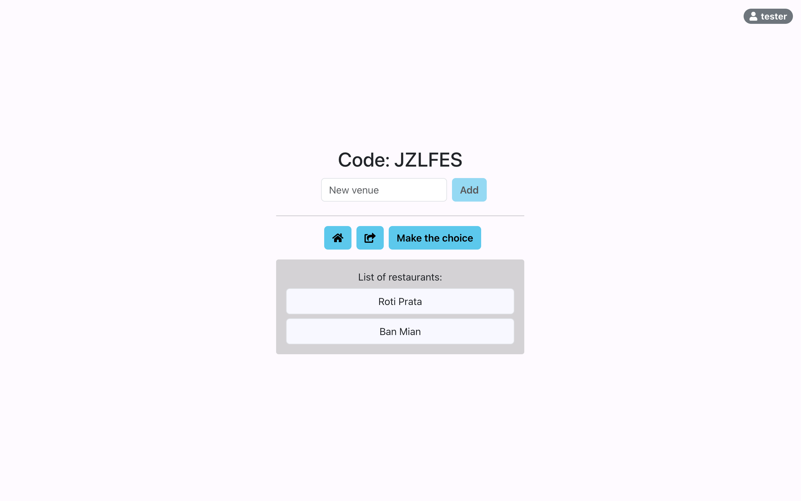

# lunch-picker

Lunch Picker - an app to collectively choose a restaurant for lunch.

## Usage
Access the web application at `http://localhost:4200`.

1. A user shall enter a username, before starting a session.
2. The session will have a unique identifier of 6 alphanumeric characters. The code can be copied and shared to other users.
3. All users can submit one or more restaurant venues, and are able to see all other restaurants that others have submitted.
4. The creator of the session may end the session.
    * A restaurant is randomly picked from all the submitted restaurants.
    * All users in the session are able to see the picked restaurant, and may not add any more restaurants.

## Dependencies
* Spring Boot 3.3
* Java 21
* Angular 18

## Design Decisions
* Basic validation (max length and alphanumeric characters only) is applied on form inputs
* Test cases have been implemented in the backend service and should be run on build.
* The Angular frontend (`lunch-picker-app`) and Spring Boot / Java backend (`lunch-picker-backend`) can be run separately according to their individual README. A `docker-compose` file has been provided for convenience of deploying both services - see [Deployment](#Deployment).
* An in-memory H2 database is included for development, and should be switched to a full-scale SQL database for production.
* Lunch plan is updated to other users through an open WebSocket session, such that they can see real-time updates to the restaurant venues and closure of the session with the final choice of venue.
* For scalability, the application could be deployed as multiple instances with load balancers and horizontally scaled database.

## API Specifications

### Create lunch plan

Endpoint

```text
POST /plan
```

Parameters

| Parameter      | Description                              |
| -------------- | ---------------------------------------- |
| `username`     | Creator of the session                   |


Example of body

```
{"username": "<username>"}
```

Using CURL

```console
$ curl -X POST "http://localhost:8080/plan" \
     -H "Content-Type: application/json" \
     -d '{"username": "<username>"}'
```

Example output

```json
{
    "id": "plan_id",
    "code":"<code>",
    "active": true,
    "userId": "<user_id>",
    "createdAt":"<created_at>"
}
```

### Get lunch plan

Endpoint

```text
GET /plan/{code}
```

Parameters

| Parameter      | Description                              |
| -------------- | ---------------------------------------- |
| `code`         | Alphanumeric 6-character code identifier |

Using CURL

```console
$ curl -X GET "http://localhost:8080/plan/<code>" 
```

Example output

```json
{
    "id": "plan_id",
    "code":"<code>",
    "active": true,
    "venues": "[<venue_1>, <venue_2>]",
    "choice": "<choice>",
    "userId": "<user_id>",
    "createdAt":"<created_at>"
}
```

### Add venues to lunch plan

Endpoint

```text
POST /plan/{code}/add
```

Parameters

| Parameter      | Description                              |
| -------------- | ---------------------------------------- |
| `code`         | Alphanumeric 6-character code identifier |
| `venue`        | New restaurant venue                     |


Example of body

```
{"venue": "<venue>"}
```

Using CURL

```console
$ curl -X POST "http://localhost:8080/plan/<code>/add" \
     -H "Content-Type: application/json" \
     -d '{"venue": "<venue_1>"}'
```

Example output

```json
{
    "id": "plan_id",
    "code":"<code>",
    "active": true,
    "venues": "[<venue_1>]",
    "userId": "<user_id>",
    "createdAt":"<created_at>"
}
```

### Close lunch plan

Endpoint

```text
POST /plan/{code}/close
```

Parameters

| Parameter      | Description                              |
| -------------- | ---------------------------------------- |
| `code`         | Alphanumeric 6-character code identifier |
| `username`     | Creator of the session                   |


Example of body

```
{"username": "<username>"}
```

Using CURL

```console
$ curl -X POST "http://localhost:8080/plan/<code>/close" \
     -H "Content-Type: application/json" \
     -d '{"username": "<username>"}'
```

Example output

```json
{
    "id": "plan_id",
    "code":"<code>",
    "active": false,
    "venues": "[<venue_1>]",
    "choice": "<choice>",
    "userId": "<user_id>",
    "createdAt":"<created_at>"
}
```
## Deployment

### Running the app

Backend server will run at `http://localhost:8080`.
Angular app will run at `http://localhost:4200`.

```
## backend
cd lunch-picker-backend
./gradlew build
java -jar build/libs/lunch-picker-1.0.0.jar

## frontend
cd ..
cd lunch-picker-app
ng serve
```

### Building the app

```
cd lunch-picker-backend
./gradlew clean build

cd ..
docker compose build
```

### Running the app

```
docker compose up
```
Then go to `http://localhost:4200`.


## Screenshots

Lunch Picker landing page


Lunch Picker adding venues



## Future improvements

* Add API authorisation for backend service to ensure limited access to trusted apps.
* Add authentication with username and password to increase security if required. Username-only is for convenience, where user does not need to setup an account just to use the LunchPickerApp.